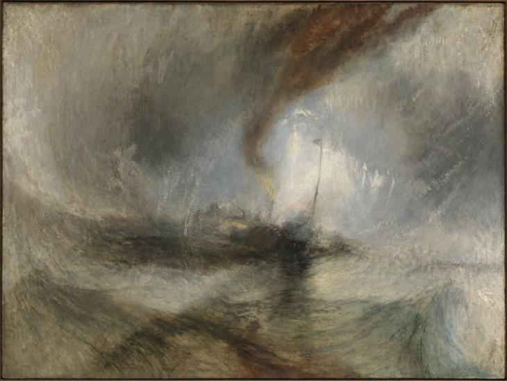

# Castabout



Castabout is an example Neovim plugin to search through a buffer.
You should probably use
[Telescope](https://github.com/nvim-telescope/telescope.nvim) instead.
Castabout is a simple demonstratation of a basic Neovim plugin in Lua.

## Requirements

Castabout optionally depends on
[dressing.nvim](https://github.com/stevearc/dressing.nvim) for fancy UI.

## Installing

Install the plugin using your favorite package manager. For example,
with [Packer](https://github.com/nvim-telescope/telescope.nvim):

```lua
return require('packer').startup(function(use)
  use({
    'https://github.com/nat-418/castabout.nvim',
    requires = 'https://github.com/stevearc/dressing.nvim'
  })
end)
```

## Configuration

There is no configuration. Just use `:Castabout forwards`
or `:Castabout backwards` to search like `/` or `?`.

You could override default keymaps like this, but probably should not:

```lua
-- Use Castabout in normal and visual modes using / and ?
vim.keymap.set({'n', 'v'}, '/', '<Cmd>Castabout forwards<CR>')
vim.keymap.set({'n', 'v'}, '?', '<Cmd>Castabout backwards<CR>')
```
